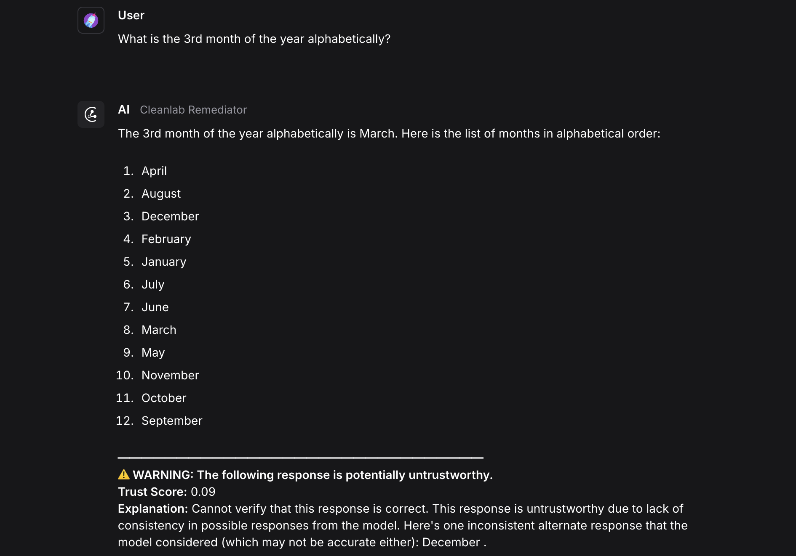
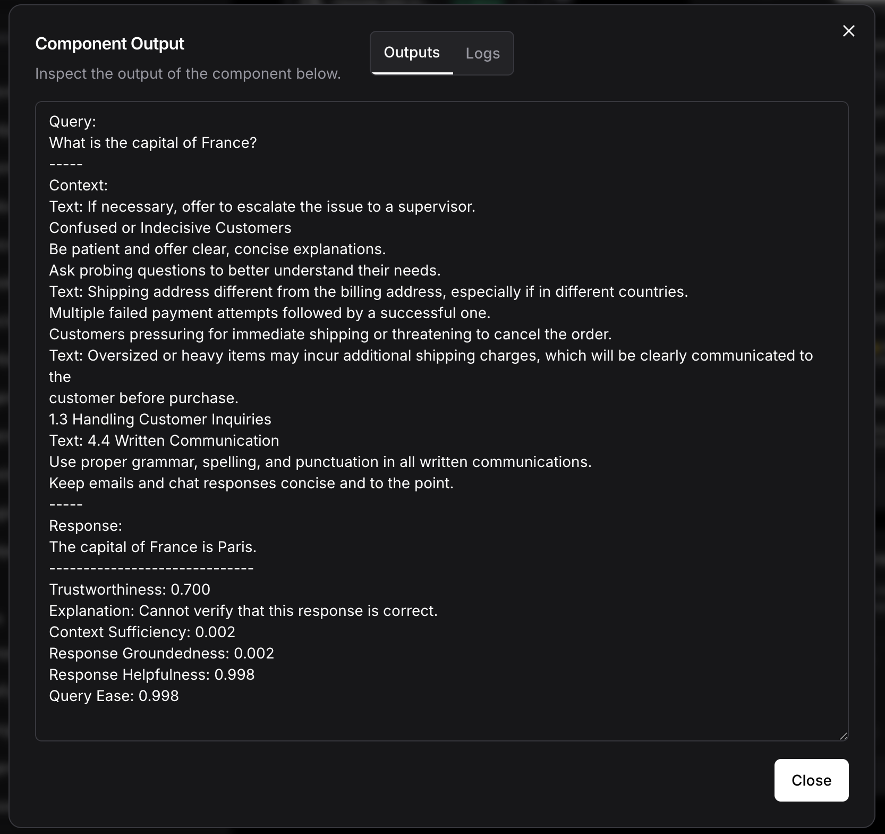

Unlock trustworthy Agentic, RAG, and LLM pipelines with Cleanlab's evaluation and remediation suite.

[Cleanlab](https://www.cleanlab.ai/) adds automation and trust to every data point going in and every prediction coming out of AI and RAG solutions.

This Langflow integration provides 3 modular components that assess and improve the **trustworthiness** of any LLM or RAG pipeline output, enabling critical oversight for safety-sensitive, enterprise, and production GenAI applications.

---

## Overview

Use this bundle to:
- Quantify trustworthiness of ANY LLM response with a **0-1 score**
- Explain why a response may be good or bad
- Evaluate **context sufficiency**, **groundedness**, **helpfulness**, and **query clarity** with quantitative scores (for RAG/Agentic pipelines with context)
- Remediate low-trust responses with warnings or fallback answers

---

## ✅ Prerequisites

Before using these components, you'll need:

- A [Cleanlab API key](https://tlm.cleanlab.ai/)

---

## 🧩 Components

### 🔹 `CleanlabEvaluator`

**Purpose:** Evaluate and explain the trustworthiness of a prompt + response pair using Cleanlab. More details on how the score works [here](https://help.cleanlab.ai/tlm/).

#### Inputs

| Name                  | Type       | Description                                                         |
|-----------------------|------------|---------------------------------------------------------------------|
| system_prompt         | Message    | (Optional) System message prepended to the prompt                   |
| prompt                | Message    | The user-facing input to the LLM                                    |
| response              | Message    | OpenAI's, Claude, etc. model's response to evaluate                 |
| cleanlab_api_key               | Secret     | Your Cleanlab API key                                               |
| cleanlab_evaluation_model                 | Dropdown   | Evaluation model used by Cleanlab (GPT-4, Claude, etc.) This does not need to be the same model that generated the response.                               |
| quality_preset        | Dropdown   | Tradeoff between evaluation speed and accuracy                      |

#### Outputs

| Name                  | Type       | Description                                                         |
|-----------------------|------------|---------------------------------------------------------------------|
| score                 | number     | Trust score between 0–1                                             |
| explanation           | Message    | Explanation of the trust score                                      |
| response              | Message    | Returns the original response for easy chaining to `CleanlabRemediator` component                          |

---

### 🔹 `CleanlabRemediator`

**Purpose:** Use the trust score from the `CleanlabEvaluator` component to determine whether to show, warn about, or replace an LLM response. This component has configurables for the score threshold, warning text, and fallback message which you can customize as needed.

#### Inputs

| Name                        | Type       | Description                                                                 |
|-----------------------------|------------|-----------------------------------------------------------------------------|
| response                    | Message    | The response to potentially remediate                                      |
| score                       | number     | Trust score from `CleanlabEvaluator`                                       |
| explanation                 | Message    | (Optional) Explanation to append if warning is shown                       |
| threshold                   | float      | Minimum trust score to pass response unchanged                             |
| show_untrustworthy_response| bool       | Show original response with warning if untrustworthy                       |
| untrustworthy_warning_text | Prompt     | Warning text for untrustworthy responses                                   |
| fallback_text              | Prompt     | Fallback message if response is hidden                                     |

#### Output

| Name                  | Type       | Description                                                                 |
|-----------------------|------------|-----------------------------------------------------------------------------|
| remediated_response   | Message    | Final message shown to user after remediation logic                         |

See example outputs below!

---

### 🔹 `CleanlabRAGEvaluator`

**Purpose:** Comprehensively evaluate RAG and LLM pipeline outputs by analyzing the context, query, and response quality using Cleanlab. This component assesses trustworthiness, context sufficiency, response groundedness, helpfulness, and query ease. Learn more about Cleanlab's evaluation metrics [here](https://help.cleanlab.ai/tlm/use-cases/tlm_rag/). You can also use the `CleanlabRemediator` component with this one to remediate low-trust responses coming from the RAG pipeline.

#### Inputs

| Name                     | Type      | Description                                                                |
|--------------------------|-----------|----------------------------------------------------------------------------|
| cleanlab_api_key                  | Secret    | Your Cleanlab API key                                                      |
| cleanlab_evaluation_model                    | Dropdown  | Evaluation model used by Cleanlab (GPT-4, Claude, etc.) This does not need to be the same model that generated the response.                               |
| quality_preset           | Dropdown  | Tradeoff between evaluation speed and accuracy                                                |
| context                  | Message   | Retrieved context from your RAG system                                     |
| query                    | Message   | The original user query                                                    |
| response                 | Message   | OpenAI's, Claude, etc. model's response based on the context and query                              |
| run_context_sufficiency  | bool      | Evaluate whether context supports answering the query                      |
| run_response_groundedness| bool      | Evaluate whether the response is grounded in the context                   |
| run_response_helpfulness | bool      | Evaluate how helpful the response is                                       |
| run_query_ease           | bool      | Evaluate if the query is vague, complex, or adversarial                    |

#### Outputs

| Name                  | Type       | Description                                                                 |
|-----------------------|------------|-----------------------------------------------------------------------------|
| trust_score           | number     | Overall trust score                                                         |
| trust_explanation     | Message    | Explanation for trust score                                                 |
| other_scores          | dict       | Dictionary of optional enabled RAG evaluation metrics                       |
| evaluation_summary    | Message    | Markdown summary of query, context, response, and evaluation results        |

---

## Example Flows

The following example flows show how to use the `CleanlabEvaluator` and `CleanlabRemediator` components to evaluate and remediate responses from any LLM, and how to use the `CleanlabRAGEvaluator` component to evaluate RAG pipeline outputs.

### Evaluate and remediate responses from any LLM

[Download](./eval_and_remediate_cleanlab.json) the flow to follow along!

This flow evaluates and remediates the trustworthiness of a response from any LLM using the `CleanlabEvaluator` and `CleanlabRemediator` components.

Simply connect the `Message` output from any LLM component (like OpenAI, Anthropic, or Google) to the `response` input of the `CleanlabEvaluator` component, along with connecting your prompt to its `prompt` input.

That's it! The `CleanlabEvaluator` component will return a trust score and explanation which you can use however you'd like.

The `CleanlabRemediator` component uses this trust score and user configurable settings to determine whether to output the original response, warn about it, or replace it with a fallback answer.

The example below shows a response that was determined to be untrustworthy (score of .09) and flagged with a warning by the `CleanlabRemediator` component.

If you don't want to show untrustworthy responses, you can also configure the `CleanlabRemediator` to replace the response with a fallback message.

### Evaluate RAG pipeline

The below flow is the `Vector Store RAG` example template, with the `CleanlabRAGEvaluator` component added to evaluate the context, query, and response. You can use the `CleanlabRAGEvaluator` with any flow that has a context, query, and response. Simply connect the `context`, `query`, and `response` outputs from any RAG pipeline to the `CleanlabRAGEvaluator` component.

Here is an example of the `Evaluation Summary` output from the `CleanlabRAGEvaluator` component.

Notice how the `Evaluation Summary` includes the query, context, response, and all the evaluation results! In this example, the `Context Sufficiency` and `Response Groundedness` scores are low (0.002) because the context doesn't contain information about the query and the response is not grounded in the context.